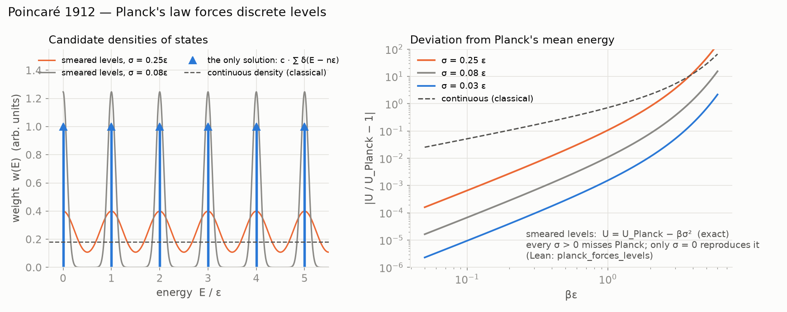
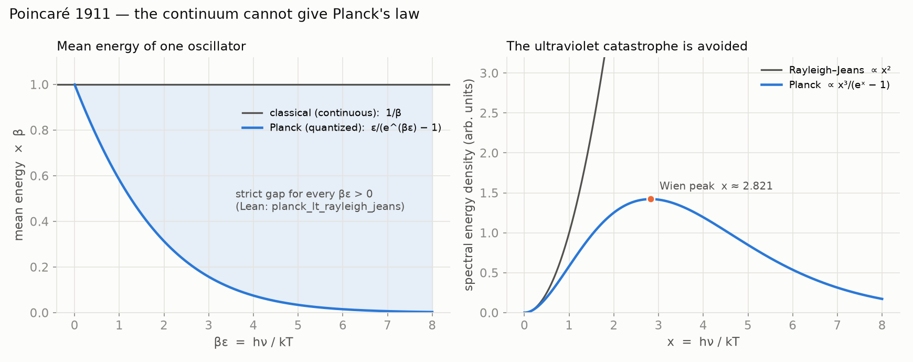

# NRS³ · Poincaré

**Planck's law forces discrete energy levels** — Poincaré's 1912 theorem in full: any density of
states with Planck's mean energy is `c · ∑ δ_{nε}`. Lean 4.

**[▶ Try it: smear the levels and watch Planck's law break](https://naype888-cloud.github.io/nrs3-poincare/)**



## Results

| Statement | Lean |
|---|---|
| quantized oscillator: mean energy `ε / (e^{βε} − 1)` | `Poincare1911.quantum_mean_energy` |
| continuous oscillator: `1/β`, strictly above Planck | `Poincare1911.planck_lt_rayleigh_jeans` |
| the Laplace transform on `β > 0` determines the weight (possibly of infinite mass) | `Poincare1912.eq_of_laplace` |
| Planck's mean energy at every `β` forces `μ = c · ∑ δ_{nε}`, `c > 0` | `Poincare1912.planck_forces_levels` |
| no density `w(E) dE` reproduces Planck | `Poincare1912.no_density_planck` |



## In NRS³

NRS works on finite lattices, where the quantum of uncertainty is algebraic. Poincaré is the
historical precedent for discreteness being forced by an exact law rather than assumed; no claim
is made that NRS derives Planck's law.

## History

Poincaré, *Sur la théorie des quanta* (1912), after the first Solvay conference (1911). The
proof here: the mean-energy law makes `Z(β)(1 − e^{−βε})` constant; tilting by `e^{−E}`, analytic
continuation of the complex moment generating function and characteristic functions separate the
weights.

## Build

Lean 4 `v4.34.0`, Mathlib `v4.34.0`, nothing else.

```bash
lake exe cache get
lake build
lake env lean Verification/Axioms.lean   # only propext, Classical.choice, Quot.sound
```

Every file: no `sorry`, lines of at most 100 characters, English headers.

## Timeline 1911–1945

NRS answers a question of the Solvay era with later tools. The series is placed in that window:
what falls inside it is the history the theorem belongs to; what falls after it is a proposal,
not part of NRS³.

| Year | Event | Repository |
|---|---|---|
| 1911 | First Solvay conference: radiation and the quanta | |
| 1911–12 | Poincaré: Planck's law forces discrete levels | **[`nrs3-poincare`](https://github.com/naype888-cloud/nrs3-poincare)** (this one) |
| 1915–20 | Szegő: limit theorems for Toeplitz matrices (the limit `C∞`, `D8`) | [base repository (NRS, NRS³)](https://github.com/naype888-cloud/nava-robertson-schrodinger) |
| 1917–27 | Einstein and de Sitter: `Λ` and the empty universe; Friedmann and Lemaître: the expanding universe | [`nrs3-de-sitter`](https://github.com/naype888-cloud/nrs3-de-sitter) |
| 1925–27 | Pauli: exclusion, shells `2n²`, spin matrices | [`nrs3-pauli-dirac`](https://github.com/naype888-cloud/nrs3-pauli-dirac) |
| 1927 | Heisenberg's relation; fifth Solvay conference: electrons and photons | |
| 1928 | Dirac: the `4 × 4` gamma matrices | [`nrs3-pauli-dirac`](https://github.com/naype888-cloud/nrs3-pauli-dirac) |
| **1929–30** | **Robertson and Schrödinger: the uncertainty inequality** | **[base repository (NRS, NRS³)](https://github.com/naype888-cloud/nava-robertson-schrodinger)** |
| 1945–46 | Mandelstam–Tamm: the time–energy bound; Rao (1945), Cramér (1946) | [`nrs3-mandelstam-tamm-cramer-rao`](https://github.com/naype888-cloud/nrs3-mandelstam-tamm-cramer-rao) |

**Tools from after the window.** Niven (1956: rational values of the trigonometric functions),
Fiedler (1973: algebraic connectivity), Lean 4 and Mathlib (the verification). The question is
of 1929; the tools are later; the checking is of 2026.

**After the window: proposals, not NRS³.** [`nrs3-penrose`](https://github.com/naype888-cloud/nrs3-penrose) (Penrose 1996, gravity-related
collapse) and [`nrs3-rovelli-lqg`](https://github.com/naype888-cloud/nrs3-rovelli-lqg) (loop quantum gravity, area spectrum 1995). They use NRS³ results
but their physical readings belong to quantum information and quantum gravity.
[`nrs3-defect-curvature`](https://github.com/naype888-cloud/nrs3-defect-curvature) restates base theorems (`D16`–`D16i`); its Bekenstein–Hawking (1973–75) reading
is a declared bridge.

## The mosaic

- [NRS and NRS³ — the base theorem](https://github.com/naype888-cloud/nava-robertson-schrodinger)
- [NRS³ · Mandelstam–Tamm and Cramér–Rao](https://github.com/naype888-cloud/nrs3-mandelstam-tamm-cramer-rao)
- [NRS³ · Landauer and Carnot](https://github.com/naype888-cloud/nrs3-landauer-carnot)
- [NRS³ · de Sitter](https://github.com/naype888-cloud/nrs3-de-sitter)
- [NRS³ · Penrose](https://github.com/naype888-cloud/nrs3-penrose) (proposal)
- [NRS³ · Pauli–Dirac](https://github.com/naype888-cloud/nrs3-pauli-dirac)
- **[NRS³ · Poincaré](https://github.com/naype888-cloud/nrs3-poincare)** (this one)
- [NRS³ · Defect and curvature](https://github.com/naype888-cloud/nrs3-defect-curvature)
- [NRS³ · Rovelli — Loop Quantum Gravity](https://github.com/naype888-cloud/nrs3-rovelli-lqg) (proposal)

## License

NRS Noncommercial License 1.0.0, see [`LICENSE`](LICENSE). Author: Eduardo Nava-Hernandez.
